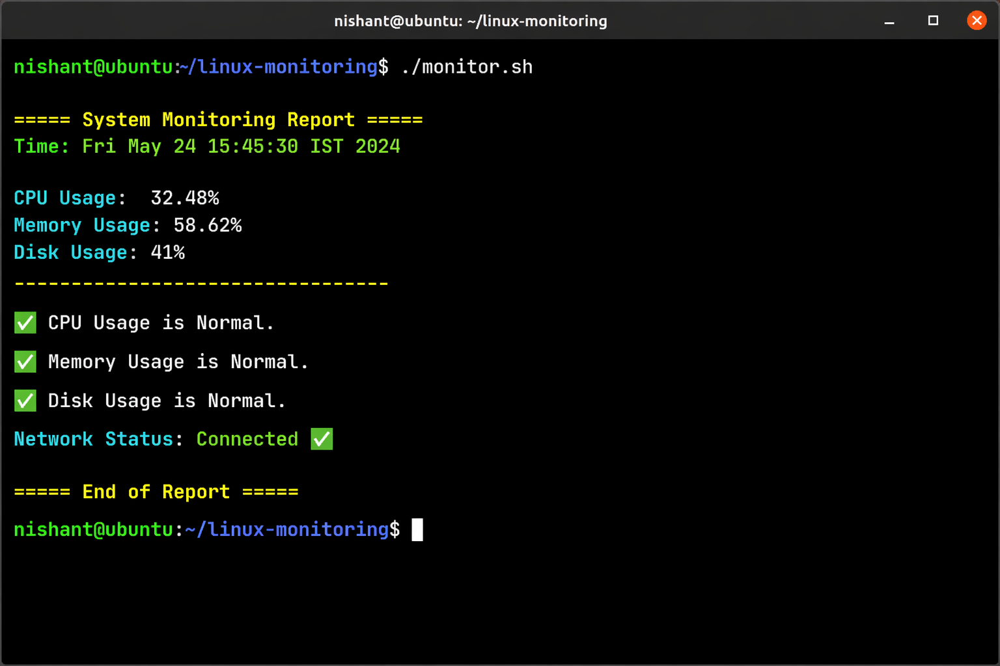

# 🚀 Smart Linux Monitoring & Alert System

A Bash-based monitoring system that tracks CPU, memory, disk, and network status in real time and generates alerts when thresholds are exceeded.

## 🔥 Features
- Monitor CPU, memory, and disk usage
- Threshold-based alert system
- Network connectivity check
- Logging of system metrics
- Automated monitoring using cron jobs

## 🛠️ Technologies Used
- Bash scripting
- Linux commands (top, free, df, ping)
- Cron (automation)

## 📊 Sample Output
===== System Monitoring Report =====  
CPU Usage: 32%  
Memory Usage: 58%  
Disk Usage: 41%  

## 📷 Demo


## ⚙️ How to Run
```bash
chmod +x monitor.sh
./monitor.sh